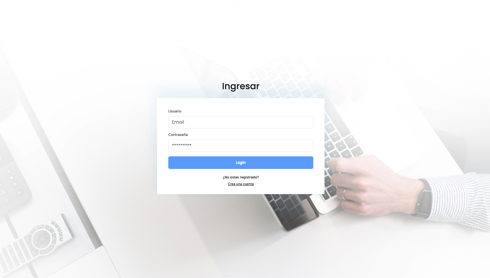
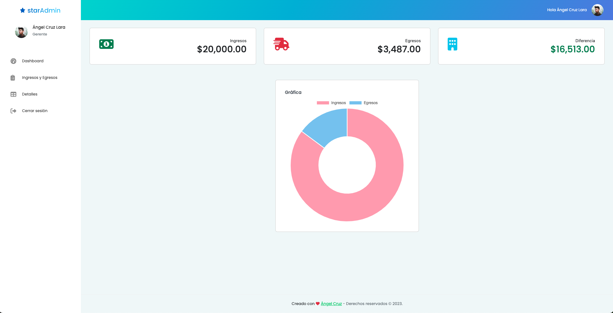

# IncomeExpenses

This project consist in a simple dashboard application to manage your income and expenses.

## General information

The project was created to practice the NgRx library implementation, how to use the Store, Effects, Actions, Reducers.

Also, can try another way to structure the project, using the modules and lazy loading (even with the NgRx implementation).

## Technologies

Project is created with:

- [Angular](https://angular.io/) v15.0.0
- [NgRx](https://ngrx.io/) v15.3
- [Bootstrap](https://getbootstrap.com/) v5.2.3
- [Firebase](https://firebase.google.com/) v9.0.8

## Features

- Authentication with Firebase
- Dashboard with the data loaded from the Firebase database
- Use of NgRx to manage the state of the application
- Use of Angular modules and lazy loading to avoid loading all the application at once
- Use of Angular lazy loading to avoid load states that are not used

## Prerequisites to run the application

- [Node.js](https://nodejs.org/en/) v18.0.0 or higher
- [Angular CLI](https://cli.angular.io/) v15.0.0 or higher

## Setup

After clone the repository, install the dependencies:

```bash
npm install
```

## Run the application

To run the application, use the command:

```bash
ng serve
```

This will available the application in the browser at the address: [http://localhost:4200](http://localhost:4200/)



You can create a new account or use the following credentials:

- Email: `admin@test.com`
- Password: `123456`

After login you can see the dashboard loaded with the data from the Firebase database.



You can see the details of the income and expenses in the table and add new items in other pages.

## Deployment

You can see the app running on [Income Expenses App](https://incomes-expenses.angelcruzl.dev/)
